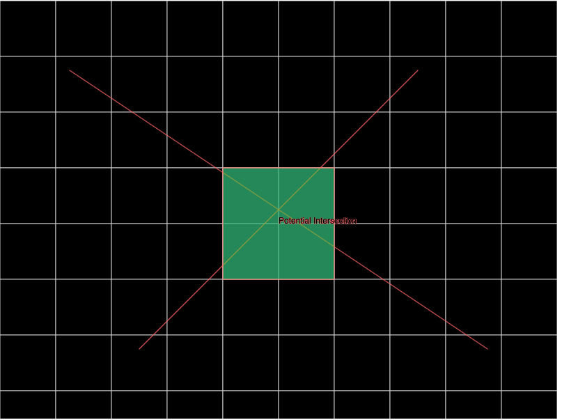

Let's break down the foundational concepts of geospatial objects and spatial joins.

### Geospatial Objects

Geospatial objects represent entities that have a physical location in space. These can be points, lines, polygons, or more complex structures. Here's a brief overview of common geospatial objects:

1. **Point**: A single location in space, defined by coordinates (e.g., latitude and longitude).
2. **Line**: A series of connected points that form a path, like a road or a route.
3. **Polygon**: A closed shape defined by a series of points, like a city boundary or a geofence (a virtual boundary for a real-world geographic area).
4. **Multi-Polygon**: Complex shapes made up of multiple polygons, often used to represent areas with holes or disjointed parts.

### Spatial Join

A spatial join is a way to combine two sets of geospatial objects based on their spatial relationship. It's like a regular database join, but instead of matching rows based on common attributes, it matches them based on spatial relationships such as intersection, containment, or proximity.

Here's a breakdown of the spatial join process using the given example:

1. **Set A**: Contains city boundaries in the US (polygons).
2. **Set B**: Contains Uber trip routes in a day (lines).
3. **Spatial Relationship**: Intersection (i.e., we want to find all pairs where a route intersects a city boundary).
4. **Spatial Join Result**: A list of pairs where each pair consists of a city boundary from Set A and a trip route from Set B that intersect.

### Example:

Let's consider a simple example:

- **Set A**: Contains two city boundaries (polygons), `City1` and `City2`.
- **Set B**: Contains three routes (lines), `Route1`, `Route2`, and `Route3`.
- **Spatial Relationship**: Intersection.

Assuming:

- `Route1` intersects `City1`.
- `Route2` intersects both `City1` and `City2`.
- `Route3` does not intersect any city.

The spatial join result would be:

- `(City1, Route1)`
- `(City1, Route2)`
- `(City2, Route2)`

### Quad Trees and R-Trees

Let's dive into the concepts of Quad-trees and R-trees, and how they can be used to calculate spatial joins like the one illustrated earlier.

### Quad-Tree

A Quad-tree is a tree data structure used to represent two-dimensional space. It's called a "quad" tree because each internal node has exactly four children, dividing the space into four equal quadrants.

Here's how a Quad-tree works:

1. **Initialization**: Start with a bounding box that encompasses all the spatial objects.
2. **Division**: If a node contains more than a certain number of objects, divide it into four equal quadrants.
3. **Insertion**: Place each object in the quadrant that contains it. If a quadrant exceeds the limit, subdivide it further.
4. **Query**: To find objects that intersect with a given rectangle, traverse the tree and check only the relevant quadrants.

### R-Tree

An R-tree is another spatial tree structure, but instead of dividing space into fixed quadrants, it groups nearby objects into bounding rectangles. This can be more efficient for data that doesn't evenly distribute across quadrants.

Here's how an R-tree works:

1. **Initialization**: Start with the spatial objects.
2. **Grouping**: Group nearby objects into bounding rectangles.
3. **Hierarchy**: Create a hierarchical tree structure where each node represents a bounding rectangle containing child rectangles.
4. **Query**: To find objects that intersect with a given rectangle, traverse the tree and check only the relevant bounding rectangles.

### Using Trees for Spatial Join

Both Quad-trees and R-trees can be used to efficiently calculate spatial joins. Here's how:

1. **Build a Tree**: Use one of the sets (e.g., Set A of city boundaries) to build a tree (either Quad-tree or R-tree).
2. **Query with the Other Set**: For each object in the other set (e.g., Set B of routes), query the tree to find intersecting objects.
3. **Collect Pairs**: The result of each query gives you the pairs of objects that satisfy the spatial relationship.

### Python Example

Here's a simplified example using a Quad-tree-like structure:

```python
class GeoTree:
    def __init__(self):
        self.rectangles = []

    def addRectangle(self, id, rectangle):
        self.rectangles.append((id, rectangle))

    def queryRectangle(self, query_rect):
        intersecting_ids = [id for id, rect in self.rectangles if self.intersects(rect, query_rect)]
        return intersecting_ids

    def intersects(self, rect1, rect2):
        # Check if two rectangles intersect
        return not (rect1.left > rect2.right or rect1.right < rect2.left or
                    rect1.top < rect2.bottom or rect1.bottom > rect2.top)

# Example usage
tree = GeoTree()
tree.addRectangle(1, City1)
tree.addRectangle(2, City2)
intersecting_ids = tree.queryRectangle(Route1)
```

### Broadcasting

The term "broadcast" in the context of distributed computing, particularly in the Map-Reduce paradigm, refers to the action of sending a piece of data to all worker nodes in the cluster. Let's break down the statement and explain each part in detail.


In a distributed computing environment, you often have multiple machines (nodes) working on different parts of a problem. Sometimes, these nodes need access to common data. Instead of having each node fetch this data independently, which can be inefficient and slow, the data is sent (or "broadcast") to all nodes.

In the context of the spatial join problem:

- **Small Table**: This refers to one of the two sets (A or B) that is small enough to fit in memory.
- **Bounding Box Tree**: This is a data structure like a Quad-tree or R-tree that represents the spatial objects in the small table.
- **Broadcast**: The small table and its bounding box tree are sent to all mappers. This means that every mapper has a complete copy of this data.

### Mapper

In the Map-Reduce paradigm:

- **Map**: The "map" phase takes the input data and breaks it down into smaller sub-problems. Each sub-problem is processed by a separate mapper.
- **Reduce**: The "reduce" phase takes the output of the mappers and combines it to produce the final result.

### Checking the Relationship for a Partition of the Large Table

- **Large Table**: This refers to the other set (not the small one) that is too big to fit in memory.
- **Partition**: The large table is divided into smaller chunks or partitions, and each mapper works on one partition.
- **Check the Relationship**: The mapper uses the small table and its bounding box tree (which it received via broadcast) to check the spatial relationship (e.g., intersection) with the objects in its partition of the large table.

### Why Broadcasting is Useful

By broadcasting the small table and its bounding box tree, every mapper has immediate access to this data in memory. This avoids the need to repeatedly read this data from disk or fetch it over the network, which can be much slower.

### Example in the Context of Spatial Join

1. **Broadcast**: Send the small table (e.g., city boundaries) and its bounding box tree to all mappers.
2. **Map**: Each mapper takes a partition of the large table (e.g., Uber trip routes) and checks which routes intersect with the city boundaries using the bounding box tree.
3. **Reduce**: Combine the results from all mappers to get the final list of intersecting pairs.

### Explainer

In this case, there is table a or b and one of them is very small. Let's say A is the small table to  start.

We assume all the mappers have the portion of B (see partions below). If there are 10 mappers, each mapper has 1/10th of B.

 A is broadcast (because its small) and then each mapper iterates over its 1/10th and feeds it to the R or quad tree. Each mapper collects any intersections and then returns that to the main process (presumably over the network).

### Partition and Distribution of Table B

- **Table B**: This is the large table, and you're correct that it's divided into partitions. If there are 10 mappers, each mapper would work on 1/10th of B.
- **How Mappers Get Portions of B**: Typically, in a distributed system like Hadoop, the data is stored across a distributed filesystem (like HDFS). When a Map-Reduce job is run, the system tries to assign mappers to the same node where the data resides, or at least on the same rack. This minimizes the data transfer over the network. The data is indeed pre-partitioned, and the system takes care of distributing the partitions to the mappers.

### Broadcasting Table A

- **Table A**: This is the small table, and it's broadcast to all mappers. Since it's small enough to fit in memory, this is an efficient operation.
- **Processing in Mappers**: Each mapper takes its partition of B and checks for intersections with A using the R-tree or Quad-tree. It collects the intersecting pairs and sends them back.

### Geospatial Objects

- **Uber Routes as Polygons**: You're right that Uber routes would typically be represented as lines or streams of points, not polygons. A route could be represented as a polyline, which is a series of connected line segments defined by points.
- **City Boundaries as Polygons**: On the other hand, city boundaries, geofences, and other area-based geospatial objects are often represented as polygons. A polygon is a closed shape defined by a series of points.


### 1. Representing the Polyline and Polygon

Checking whether a polyline (representing a route) intersects with a polygon (representing a city boundary) using an R-tree involves several steps. Here's how it works:

- **Polyline**: A polyline (the route) is represented as a series of connected line segments. Each line segment is defined by two points (start and end).
- **Polygon**: A polygon (the city boundary) is represented as a closed shape defined by a series of points.

### 2. Building the R-Tree

- **R-Tree for Polygons**: You can build an R-tree using the polygons (city boundaries). Each entry in the R-tree represents a bounding rectangle that encompasses a polygon.

### 3. Querying the R-Tree with the Polyline

- **Bounding Rectangle for Polyline**: Compute a bounding rectangle for each segment of the polyline. This rectangle encloses the line segment.
- **Query R-Tree**: For each bounding rectangle of the polyline, query the R-tree to find all bounding rectangles (of polygons) that intersect with it.

### 4. Refining the Results

- **Check Actual Intersection**: The R-tree query gives you candidate polygons that might intersect with the polyline. You then need to check the actual intersection between the polyline and these candidate polygons. This involves checking whether any segment of the polyline intersects with the edges of the polygon.
- **Geometry Libraries**: Often, specialized geometry libraries are used to perform these precise intersection checks, as they can be mathematically complex.

### Example in Python

Here's a high-level example using Python (note that actual implementation would require a geometry library like Shapely):

```python
from rtree import index

# Create an R-tree index for polygons (city boundaries)
idx = index.Index()
for i, polygon in enumerate(city_boundaries):
    bounding_rect = polygon.bounds  # Assuming polygon.bounds gives the bounding rectangle
    idx.insert(i, bounding_rect)

# Check intersections with a polyline (route)
for segment in polyline_segments:
    bounding_rect = compute_bounding_rect(segment)  # Function to compute bounding rectangle for segment
    intersecting_polygon_ids = list(idx.intersection(bounding_rect))
    
    # Check actual intersection with candidate polygons
    for polygon_id in intersecting_polygon_ids:
        polygon = city_boundaries[polygon_id]
        if actual_intersection(segment, polygon):  # Function to check actual intersection
            print(f"Segment {segment} intersects with city {polygon_id}")
```

### Map-Only Strategy

In the map-only strategy, each mapper processes a partition of the large table (e.g., Table B) and checks for intersections with the small table (e.g., Table A) that has been broadcast to all mappers. The results from each mapper are directly written to the output, and there is no need to combine or aggregate the results further.

### Introducing a Reduce Stage

A reduce stage would involve taking the output from all the mappers, shuffling and sorting it, and then processing it further to combine or aggregate the results. In some problems, this is necessary to produce the final output.

### Why Map-Only Might Be More Efficient

1. **No Shuffling and Sorting**: In a typical Map-Reduce job, the system must shuffle and sort the output from the mappers before it is sent to the reducers. This involves network transfer and can be computationally expensive. In a map-only job, this step is skipped.

2. **No Redundant Computation**: Since the small table is broadcast to all mappers, each mapper has all the information it needs to produce its part of the final result. There's no need to combine or aggregate results across mappers.

3. **Simpler Data Flow**: The data flow in a map-only job is simpler and more direct. Each mapper writes its output independently, without coordination with other mappers. This can make the job easier to understand, implement, and debug.

4. **Optimized for Spatial Join**: In the specific case of a spatial join where one table is small enough to be broadcast, the map-only strategy aligns well with the problem's characteristics. Each mapper can independently compute the intersections for its partition of the large table, and there's no benefit to combining these results in a reduce stage.

## What if the bounding boxes for cities or paths are too big to fit in memory?

### Case Two: Bounding Box Tree in Memory

In this scenario, the geospatial objects are complicated (e.g., polygons with hundreds of edges), and only a bounding box tree of a table can be held in memory. The solution involves two main stages: filtering and refining.

### Stage 1: Filtering with Bounding Box Tree

1. **Create Bounding Box Tree**: For one of the tables (let's say Table A), create a bounding box tree. This tree represents the spatial objects using their bounding rectangles, which are simpler and take up less space in memory.

2. **Broadcast Bounding Box Tree**: Send (broadcast) the bounding box tree to all mappers.

3. **Filter with Mappers**: Each mapper takes its partition of the other table (Table B) and queries the bounding box tree to find candidate pairs that might intersect. This is a filtering stage, reducing the number of pairs that need to be checked in detail.

4. **Collect Candidates**: The mappers send the candidate pairs back to the main process. These candidates are the pairs that might intersect based on the bounding box check but need to be refined further.

### Stage 2: Refining the Candidates

1. **Second Map-Reduce Job**: Start a new Map-Reduce job to refine the candidates. This involves checking the actual intersection between the spatial objects, not just their bounding boxes.

2. **Map**: The mappers take the candidate pairs and perform detailed intersection checks. This might involve checking whether the edges of the polygons intersect, using precise geometric calculations.

3. **Reduce**: If necessary, the reducers combine the results from the mappers to produce the final list of intersecting pairs.

### Why Two Stages?

- **Memory Constraints**: Since the full geospatial objects are too complex to fit in memory, the bounding box tree provides a way to represent them more simply.
- **Efficiency**: The filtering stage quickly narrows down the candidate pairs, reducing the amount of computation needed in the refining stage.
- **Flexibility**: By separating the filtering and refining stages, the solution can handle different levels of complexity in the spatial objects and adapt to different memory constraints.

## What if nothing fits in Memory? Uh oh

Here could make a two level tree - a first level which is coarse bounding boxes and then under each top level node
a detailed tree.

### Coarse Overview in Two-Level Trees

1. **Top-Level Tree**: The top-level tree in the two-level structure provides a coarse overview of the spatial data. It divides the entire spatial area into large regions or chunks. These regions are represented by the leaf nodes of the top-level tree.

2. **Bounding Boxes at Coarse Level**: Each of these coarse regions can be thought of as a large bounding box that encompasses multiple geospatial objects. It's like a bounding box for a group of objects rather than for individual objects.

3. **Sub-Trees for Detail**: Within each coarse region (leaf node of the top-level tree), a sub-tree is built to represent the individual bounding boxes of the geospatial objects in that region. This sub-tree provides the detailed information about the objects within the coarse region.

### Why Use Coarse Partitioning?

- **Memory Efficiency**: By dividing the space into large regions at the top level, the structure can represent a large dataset without needing to store all the individual bounding boxes in memory at once.

- **Query Efficiency**: When querying for intersections, the top-level tree quickly narrows down the relevant coarse regions. Then the sub-trees provide the detailed information for those regions. This two-level approach speeds up queries by filtering out irrelevant regions at the top level.

- **Scalability**: The two-level structure can handle large datasets by providing a hierarchical representation that adapts to different scales of data.

### Example

Imagine you have a map of a country, and you want to represent all the buildings:

- **Top-Level Tree**: Divide the country into states (coarse regions). Each state is like a large bounding box.
- **Sub-Tree for Each State**: Within each state, build a sub-tree to represent the individual buildings (detailed bounding boxes).

### Memory and Nodes in the Tree

The number of nodes in the top-level tree (or the granularity of the coarse partitioning) is typically determined by considerations related to what can fit into memory on the mappers, as well as other factors related to the specific use case and data distribution. Here's how it works:

### Determining the Number of Nodes in the Top-Level Tree

1. **Memory Constraints**: The top-level tree must be small enough to fit into the memory available on the mappers. This constraint helps determine how coarsely the space can be partitioned at the top level.

2. **Data Distribution**: The way the geospatial objects are distributed across the space can also influence the structure of the top-level tree. If objects are densely clustered in certain areas, it might make sense to have more fine-grained partitioning in those areas.

3. **Query Patterns**: The expected types of queries and access patterns can also influence the structure. If certain regions are queried more frequently, it might be beneficial to have more detailed partitioning in those regions.

4. **Balance Between Levels**: There needs to be a balance between the top-level tree and the sub-trees. If the top-level tree is too coarse, the sub-trees might become too large and complex. If the top-level tree is too fine-grained, it might not provide enough benefit in terms of memory efficiency and query speed.

### Example

Imagine you have a large dataset of geospatial objects representing buildings in a country, and you want to build a two-level tree:

- **Top-Level Tree**: You might divide the country into regions based on states or major cities, depending on the memory constraints and the distribution of buildings.

- **Sub-Trees**: Within each region, you would build a sub-tree to represent the individual buildings.

### Coarse Tree - Solution:

This solution involves building a hierarchical structure with two levels of trees for each table.

1. **Top-Level Tree**: This tree partitions the space coarsely. Think of it as dividing the entire spatial area into large chunks or regions. Each leaf node of this top-level tree represents one of these coarse regions.

2. **Sub-Tree for Each Leaf Node**: Within each coarse region represented by a leaf node of the top-level tree, a sub-tree is built to represent the bounding boxes of the geospatial objects in that region.

3. **Querying**: When querying for intersections, you would first query the top-level tree to find the relevant coarse regions, then query the corresponding sub-trees for the detailed intersections.

4. **Why Two Levels?**: By using two levels, this approach can handle large datasets that don't fit in memory. The top-level tree provides a coarse overview, and the sub-trees provide detailed information for specific regions.

### Course Tree - Details

1. **Determine Granularity for Top-Level Trees**: Based on the available RAM on the mappers and the size of the datasets, determine the granularity for the top-level trees (A-Top and B-Top). This involves deciding how coarsely to partition the space.

2. **Build Top-Level Trees (A-Top, B-Top)**: Partition both Set A (cities) and Set B (routes) into coarse regions, creating top-level trees. This can be done centrally or distributed across mappers, depending on the size and complexity.

3. **Check for High-Level Intersections**: Identify intersections between the coarse regions represented by A-Top and B-Top. This gives you pairs of regions that might contain intersecting objects.

4. **Build Sub-Trees for Intersecting Regions**: For each pair of intersecting coarse regions, build sub-trees to represent the individual objects (cities and routes) within those regions. This provides the detailed information needed for precise intersection checks.

5. **Send to Mappers for Granular Check**: Delegate the intersection checks for the sub-trees to the mappers. Each mapper takes a pair of sub-trees (one from A and one from B) and checks for detailed intersections between the objects.

6. **Collect Intersections**: Gather the intersections found by the mappers. This gives you the final list of intersecting pairs (e.g., cities and routes that intersect).

7. **Optimization Considerations**: Depending on the data distribution and query patterns, there might be opportunities to optimize the process, such as by caching frequently used sub-trees or by adapting the granularity dynamically.

### Grid Indexing for Geospatial Objects

#### What is Grid Indexing?
Grid indexing is a spatial indexing technique used to quickly locate objects in a two-dimensional space. It divides the space into a grid of cells, and each cell contains references to the objects that lie within its boundaries. This allows for efficient querying of spatial relationships, such as intersections or proximity.

#### How Does Grid Indexing Work?
1. **Divide the Space**: The entire spatial region is divided into a grid of equal-sized cells.
2. **Assign Objects to Cells**: Each geospatial object (e.g., a city boundary or a route) is assigned to one or more cells based on its location and shape.
3. **Query Processing**: When querying for intersections or other spatial relationships, only the relevant cells are examined, reducing the search space and improving efficiency.

### Applying Grid Indexing to the Given Scenario

#### Table A: Cities
- **Objects**: Boundaries of cities.
- **Grid Indexing**: The spatial region containing all cities is divided into a grid. Each city is assigned to the cells it intersects.

#### Table B: Uber Routes
- **Objects**: Paths of Uber routes.
- **Grid Indexing**: Similarly, the spatial region containing all routes is divided into a grid. Each route is assigned to the cells it intersects.

#### Finding Intersections
1. **Build Grid Indexes**: Create grid indexes for both tables A and B.
2. **Identify Potential Intersections**: For each cell in table A's grid, find the corresponding cell in table B's grid. The objects in these cells have the potential to intersect.
3. **Check Actual Intersections**: For each potential intersection, perform a detailed geometric intersection test to confirm if the city and route truly intersect.

### Real-World Example
Imagine you have a map of New York City, and you want to find which Uber routes intersect with Manhattan. By using grid indexing:
- Manhattan's boundaries are assigned to specific cells in table A's grid.
- Each Uber route is assigned to specific cells in table B's grid.
- You can quickly identify which routes have the potential to intersect with Manhattan by examining the corresponding cells, and then confirm the actual intersections with a detailed geometric test.

### Code Snippet (Python using Geopandas)
```python
import geopandas as gpd

# Load cities and routes as GeoDataFrames
cities = gpd.read_file('cities.shp')
routes = gpd.read_file('routes.shp')

# Create a spatial index (grid index) for both
cities_sindex = cities.sindex
routes_sindex = routes.sindex

# Find potential intersections
possible_matches_index = list(cities_sindex.intersection(routes.unary_union.bounds))
possible_matches = cities.iloc[possible_matches_index]

# Check actual intersections
actual_intersections = possible_matches[possible_matches.intersects(routes.unary_union)]

# Result: actual_intersections contains cities that intersect with the routes
```

### Data Structure for Grid Indexing

#### 1. **Grid Cells**:
   - **Description**: The grid is represented as a two-dimensional array, where each cell contains a list of references to the objects that intersect with it.
   - **Structure**: `grid[row][column] = [list of objects]`

#### 2. **Spatial Objects (e.g., Manhattan's Boundaries, Uber Routes)**:
   - **Description**: Each spatial object is associated with the cells it intersects. This association can be stored in a separate data structure.
   - **Structure**: `object_cells[object_id] = [list of cell coordinates]`

### Process to Identify Potential Intersections

#### Step 1: Assign Objects to Cells
- **For Manhattan's Boundaries**: Iterate through the cells that intersect with Manhattan and add a reference to Manhattan in those cells.
- **For Uber Routes**: Iterate through the cells that intersect with each Uber route and add a reference to that route in those cells.

#### Step 2: Identify Cells with Potential Intersections
- **Iterate through the cells that contain Manhattan's boundaries**.
- **For each such cell, check if there are any Uber routes in the same cell**.
- **If a cell contains both Manhattan's boundaries and Uber routes, it represents a potential intersection**.

### Code Snippet (Python-like Pseudocode)

```python
# Define the grid
grid = [[[] for _ in range(columns)] for _ in range(rows)]

# Assign Manhattan's boundaries to cells
for cell in manhattan_cells:
    grid[cell.row][cell.column].append('Manhattan')

# Assign Uber routes to cells
for route in uber_routes:
    for cell in route_cells[route]:
        grid[cell.row][cell.column].append(route)

# Identify potential intersections
for cell in manhattan_cells:
    if len(grid[cell.row][cell.column]) > 1:
        print(f"Potential intersection in cell ({cell.row}, {cell.column})")
```

### What if it doesn't fit in memory

> Note of care, this is me sounding out how I would do this, I don't know if this is the "correct" approach
> I'm still researching this!

Serializing the grid index and storing it in a linear format is a practical approach, especially when dealing with distributed systems and large-scale data. Your representation captures the essential information needed to reconstruct the spatial relationships within the grid.

### Structure of Serialized Grid Index

- **x pos, y pos**: The coordinates of the cell within the grid.
- **id**: The identifier of the entity (e.g., city or Uber route) that resides in the grid cell.
- **type**: A categorization of the entity, such as 0 for cities and 1 for Uber routes.

### Example Serialization

Using the example you provided, the serialized grid index might look like this:

```
4,3,1,0
4,4,1,0
5,3,1,0
5,4,1,0
1,1,2,1
2,1,2,1
etc
```

Here, the rows represent the cells that Manhattan (id=1, type=0) and an Uber route (id=2, type=1) intersect.

For example here is a really simply grid where the green squares are "Manhattan" and the red lines are "Uber routes"

I'm positive this is an over simplification but, for now..



The assumption here is that we could serialize the entire grid onto a distributed file store, query it 
in chunks on various mappers, do follow-on queries for intersections and then reduce the result set to 
a second job that would do detailed spatial checks for intersected subtrees.

Each mapper would receive a chunk of route ids to process. It would query for the cell ranges associated with
the route id and do a check against the city cells it had in memory. Intersections would be captured.

This assumes we can query cells from the main store which might not be possible or could be slow. 

https://conservancy.umn.edu/bitstream/handle/11299/182261/Eldawy_umn_0130E_17238.pdf?sequence=1