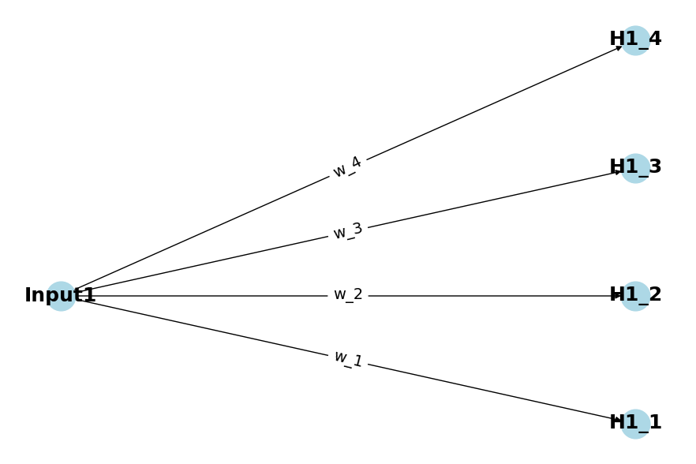

# Multi-layered Perceptron (MLP)

An MLP is a type of neural network. In many contexts, the terms "Multi-layered Perceptron" and "neural network" can be used interchangeably. The MLP is often considered one of the simplest types of neural networks, making it an excellent starting point for understanding machine learning fundamentals.

The objective of this guide is not to build a production-quality neural network or even a particularly robust example. Instead, we aim to demonstrate the core principles that allow a neural network to learn and make predictions. By understanding these principles, you'll gain an intuitive grasp of the training process, which involves updating a model's weights and biases.

## What You Will Learn:

* The basic idea behind neural networks and MLPs
* The mechanics of forward and backward propagation
* How to train an MLP to make predictions

We will initially focus on the practical implementation, glossing over the mathematics involved. Once we've built a foundational understanding, we'll circle back to delve into the mathematical details, ensuring a comprehensive grasp of what happens at each step.

## Weights and Biases: The Tuning Knobs of a Neural Network

Training a neural network is sort of like tuning a guitar. You're going to make some minor adjustments to your strings until you get a specific note. 

At its most basic, numbers go into a neural network and are essentially run through a number of transformations. The original numerical values are augmented by weights and biases to achieve a specific result. An untrained neural network (i.e., one with randomly generated weights and biases) won't produce the results we want. But when these weights and biases are adjusted (a.k.a. tuned), we can eventually achieve the results we want.

In the neural network we're training we'll essentially train a network to 
multiply an input number by 100. That seems like an incredibly silly task, why would we 
do that if we could just do `i * 100`, but this silly task actually demonstrates the
power for weights and biases. You see, we'll demonstrate that given a random set of
weights and a random set of biases and a series of examples that we can tune these
augmentation such that our network can be made to predict what `i * 100` would produce.

### What are Weights?

Weights are the strength of the connections between neurons in different layers of the network. You can think of them as the influence one neuron has over the next. In a mathematical sense, each weight represents the multiplier for an input value. 

For example, consider a simple equation for a straight line $\( y = mx + b \)$. Here, $\( m \)$ would be akin to the weight—it determines how much $\( x \)$ influences $\( y \)$.

### What are Biases?

Biases allow neurons to have some flexibility in activation. In the straight line equation $\( y = mx + b \)$, the $\( b \)$ term serves as a bias, shifting the line up or down.

### Why are they important?

Weights and biases are crucial because they are what the neural network adjusts during learning. Through a process called backpropagation, which we'll cover later, the network tweaks these parameters to minimize the difference between its predictions and the actual data. As these "tuning pegs" get adjusted, the network becomes better at its task.

### Introducing the Code

All the concepts discussed in this article are accompanied by a practical Python example [mlp.py](mlp.py), which is in this repo and introduces a neural network we used to demonstrate that we could train it to multiply by 100.

The Python file contains a class named `MultiLevelPerceptron`, which serves as our neural network model for this tutorial. While we'll go into detail about how the code works later on, for those who like to jump ahead or want a sneak peek, feel free to explore this file.

The class encapsulates all the functionalities we're going to discuss, from initializing weights and biases to performing forward and backward propagation. By the end of this article, you'll understand how every line of this code contributes to the learning process of the neural network.

While we'll reference snippets here, you should definitely clone the repo and give the file a run.

#### The Constructor

The constructor of our `MultiLevelPerceptron` class takes an array of integers called `layers`, which specifies the number of neurons in each layer of the neural network. 

For example, to predict our multiplied input, we create an instance of the MLP class like this:

```python
mlp = MultiLevelPerceptron([1, 4, 3, 2, 1])
```

These numbers aren't arbitrary. The first and last layers have only 1 neuron because we're transforming one number (our input) into another number (our output). The middle layers, represented by `4, 3, 2`, are designed to introduce some complexity into the network. This complexity helps the network learn more intricate patterns, allowing for better predictions without taking too much time to train. You can think of more complexity basically meaning more variables. In the same way that multivariate equations can represent more complex geometric patterns, more variables (or neurons in this case) allow networks to make more intricate connections about data. As a result, the network can make more advanced predictions.

Internally, the constructor does the following:

1. Captures the `layers` array to set the architecture.
2. Initializes empty lists for `weights` and `biases` that will be filled later.
3. Sets an activation function, `self.linear` in this case (we'll discuss activation functions in detail later).
4. Calls the `_initialize_weights_and_biases()` method to actually set the initial random weights and zero biases.

Here's the code snippet for the constructor:

```python
class MultiLevelPerceptron:
    def __init__(self, layers):
        self.layers = layers
        self.weights = []
        self.biases = []
        self.activation_function = self.linear
        self._initialize_weights_and_biases()
```

#### The Initialization

Initialization sets up our weights and biases. To understand what's happening here, we need to cover some basics. We discussed earlier that the network essentially augments our input. How does it do that? Through matrix operations.

When the input is provided, its value will be augmented by each neuron in the next layer. Here's a basic diagram to help illustrate this concept:



Imagine we have a layer configuration `[1, 4, 3, 2, 1]`, as in our example. The weight matrix for the transition from the input layer with 1 neuron to the first hidden layer with 4 neurons would look something like this:

<p>
  <strong>Weight Matrix 1</strong> = 
  <span style="font-family: 'Courier New', Courier, monospace;">[w<sub>11</sub>]</span>
  &rarr;
  <span style="font-family: 'Courier New', Courier, monospace;">[w<sub>21</sub>, w<sub>22</sub>, w<sub>23</sub>, w<sub>24</sub>]</span>
</p>

This is a matrix of dimensions `1 x 4`.

The next transition, from the first hidden layer with 4 neurons to the second hidden layer with 3 neurons, would have a Weight Matrix of dimensions `4 x 3`. 

<!-- Weight Matrix 2 HTML Representation -->

<p>
  <span style="font-family: 'Courier New', Courier, monospace;">Weight Matrix 2 = </span>
  <span style="font-size: 1.2em;">
    [
    <span style="vertical-align: 0.5em;">
      <table style="display: inline-table; margin: 0; padding: 0; border: none;">
        <tr>
          <td style="border: none;">w<sub>21</sub></td>
          <td style="border: none;">w<sub>22</sub></td>
          <td style="border: none;">w<sub>23</sub></td>
        </tr>
        <!-- ... rest of the matrix -->
      </table>
    ]
  </span>
</p>

We use `np.random.randn` to initialize these weights randomly, which is a common practice in neural network training. According to the numpy documentation, `np.random.randn` generates an array filled with random floats sampled from a Gaussian distribution with mean 0 and variance 1. 

Here's how you can generate such matrices in Python:

```python
import numpy as np
np.random.randn(4, 1)
np.random.randn(3, 4)
```

Here is what that looks like in the repl:

```python
>>> import numpy as np
>>> np.random.randn(4, 1)
array([[-0.79168001],
       [-0.49160509],
       [-1.57004755],
       [-1.16798333]])

>>> np.random.randn(3, 4)
array([[ 0.92383058, -0.53372624,  0.39269497, -2.23828113],
       [-0.53587544,  0.17031796, -0.62955261,  0.42078053],
       [ 0.74553714, -0.25580175, -0.65622554,  0.7881166 ]])
```

Think of each weight as a "pathway" for information flow between two neurons in adjacent layers. The matrix is essentially a structured way to store all these different pathways. The number of rows in the Weight Matrix corresponds to the neurons in the layer we're transitioning to, and the number of columns corresponds to the neurons in the layer we're transitioning from. This setup is because each neuron in the next layer is connected to every neuron in the previous layer.

In our code, biases are initialized to zero. This is a common practice and generally works well for small networks like the one we're working with.

Up next, we'll see how this all comes together in forward propagation.

#### A Note on Activation Functions

In our example, we're using a linear activation function. That's simply because our task is to perform a linear transformation on the input—multiplying it by 100. A linear activation function does nothing to the weighted sum `z`, effectively leaving it unchanged:

<p>
  <strong>Linear Function: </strong>
  f(x) = x
</p>


However, not all tasks are best suited for a linear activation function. For instance, in classification tasks, the sigmoid activation function is often used. The sigmoid function maps any input into a value between 0 and 1, which can be useful for probabilities:

<p>
  <strong>Sigmoid Function: </strong>
  &#963;(z) = 1 / (1 + e<sup>-z</sup>)
</p>

The choice of activation function can greatly influence a neural network's performance and is usually tailored to the specific problem you're trying to solve.

#### Forward Propagation: Making Predictions

Forward propagation is the process by which a neural network makes a prediction based on input data. It's called "forward" because we pass the data through the network in a single direction, from the input layer all the way through to the output layer.

##### The Function Signature

The `predict` function takes a single argument `x`, which is our single random number. We want the network to essentially
multiply this number by 100 when it makes its prediction.

```python
def predict(self, x):
```

##### Preparing the Input

The first line inside the function reshapes the input `x` into a column vector. This ensures that the input is compatible with the weight matrices for matrix multiplication.

```python
x = np.array(x).reshape(-1, 1)
```

##### Initializing Containers for Activations and "Z"s

The function also initializes two lists, `activations` and `zs`. The variable `z` often refers to the linear combination of the input features and the weights, before applying the activation function.

- `activations` keeps track of the output of each layer's neurons after applying the activation function. 
- `zs` stores the weighted sums before the activation function is applied at each layer.

```python
activations = [x]
zs = []
```

The first activation is simply `x`, our input number.

##### The Core Loop

Then, the function enters a loop that iterates through each layer of the network to perform the actual forward propagation.

```python
for weight, bias in zip(self.weights, self.biases):
```

For each layer, the code performs the following steps:

1. **Weighted Sum**: It multiplies the current `x` (activation from the previous layer) by the weight matrix and then adds the bias. This is the weighted sum `z`.

    ```python
    z = np.dot(weight, x) + bias
    ```
   
    The dot product (`np.dot`) here represents the sum of the products of corresponding entries of the two sequences of numbers. 

   For example remember our weight matrices from earlier? Our first iteration will combine our input with the first matrix, effectively, sending the output of the first layer to the second layer, and augmenting each value. 

   ```python
   >>> foo = np.random.randn(4, 1)
   >>> x
   array([[0.5]])
   >>> z = np.dot(foo, x) # bias not included for brevity
   >>> z
   array([[ 0.78350497],
       [ 0.0137708 ],
       [ 0.59015738],
       [-0.3671776 ]])
   ```
   > In the example using the dot product, note that this is a simplified example. In the actual code, biases are also added to each neuron's output.

   This then continues, where each subsequent activation is sent to the next layer to be augmented.

2. **Storing Z**: It appends this `z` to the `zs` list.

    ```python
    zs.append(z)
    ```

3. **Activation Function**: It then applies the activation function to `z` to get the next `x`, or the activation for the next layer. The activation function used here is the linear function, which essentially does nothing (i.e., \( f(x) = x \)).

    ```python
    x = self.activation_function(z)
    ```

4. **Storing Activation**: Finally, it appends this new `x` to the `activations` list.

    ```python
    activations.append(x)
    ```
   
##### Sanity Check for NaN

After the loop, the function performs a sanity check to make sure that no `NaN` (Not a Number) values have crept into the calculations. We will
talk more about why this is here later in exploding gradients and scaling

```python
self.assert_nan(x, activations, zs)
```

##### Returning the Output

Finally, the function returns the final `x` (the network's prediction), along with the `activations` and `zs` for each layer. These are not only useful for debugging but also critical for backpropagation.

```python
return x, activations, zs
```

Of course without training, the output of the net is going to be junk. For example, making a 
prediction as is looks like this:

```python
X, y = generate_data()

X, y = MultiLevelPerceptron.scale_data(X, y)

# Initialize and train the neural network
mlp = MultiLevelPerceptron([1, 4, 3, 2, 1])

#mlp.train(X, y, epochs=1000, learning_rate=0.01)

# Test the trained network
for i in range(0, 10):
    X_test, y_test = generate_data(num_samples=1)
    print("Generated: ", X_test, " expect:", y_test, " predict:", mlp.predict(X_test)[0])
```

Yields:

```
(venv) jmordetsky in ~/curriculum (main) > python3 perceptron/mlp.py 
Generated:  [0.20471242]  expect: [20.4712423]  predict: [[0.44438418]]
Generated:  [0.29994221]  expect: [29.99422076]  predict: [[0.65110642]]
Generated:  [0.20042107]  expect: [20.04210658]  predict: [[0.43506862]]
Generated:  [0.91912764]  expect: [91.91276357]  predict: [[1.99521737]]
Generated:  [0.89951592]  expect: [89.9515918]  predict: [[1.95264479]]
Generated:  [0.93948362]  expect: [93.94836198]  predict: [[2.03940559]]
Generated:  [0.45195635]  expect: [45.19563525]  predict: [[0.98109461]]
Generated:  [0.49573883]  expect: [49.57388271]  predict: [[1.07613642]]
Generated:  [0.64975961]  expect: [64.97596097]  predict: [[1.41048056]]
Generated:  [0.20056979]  expect: [20.05697901]  predict: [[0.43539147]]
```

Very clearly, this is not useful. But don't worry—this is entirely expected for a neural network that hasn't been trained yet. This leads us to our next step: training and backpropagation!

# Training and Backpropagation

Earlier we said:

> At its most basic, numbers go into a neural network and are essentially run through a number of transformations. The original numerical values are augmented by weights and biases to achieve a specific result. An untrained neural network (i.e., one with randomly generated weights and biases) won't produce the results we want. But when these weights and biases are adjusted (a.k.a. tuned), we can eventually achieve the results we want.

Backpropagation is the process whereby those guitar knobs are tuned. When you are tuning a guitar you will pluck a string and an atuned musician will know which way to turn the knob based on the sound the strum produces. 

Backpropagation is like that for the neural network. It will examine the results of a prediction (a pluck of a string) and then adjust the weights and biases of the network in a direction that it believes will lead it to the correct answer, where the correct answer is the sample training data it is provided.

So, backpropagation is fundamentally an optimization algorithm for minimizing the error in the neural network's predictions.

Let's look at our training loop first:

## The Training Loop

The training loop is where the magic of backpropagation happens. It's the central hub where data flows in, gets processed, and adjustments are made. Let's break down the major components:

### Function Signature and Parameters

```python
def train(self, X, y, epochs=1000, learning_rate=0.01):
```

The `train` method takes four parameters:

- `X`: The input data. This is the data we want to make predictions on. In our case, this is a series of randomly generated numbers that we want the model to successfully multiply by 100
- `y`: The truth. Here, `y` are the values that *should* come out of the neural network if it is doing its job well. These are used to calibrate the system. If `X` are the sounds our guitar
string currently makes, `y` are the sounds it should make.
- `epochs`: This signifies the total number of cycles (forward and backward passes) through the entire dataset.
- `learning_rate`: The rate at which we adjust our weights and biases. This is actually a really important value because it's the value we will use to adjust weights. If it's too low, training will take forever. If it's too high, we'll bounce around and never land anywhere meaningful. This is like how finely we'll twist the guitar knobs. If we twist too lightly, we'll be there all day, too hard and we'll constantly overshoot the note target.

### The Epoch Loop

The code enters a loop that iterates for the number of `epochs` specified. An epoch is one complete forward and backward pass of all the training examples.

```python
for epoch in range(epochs):
```

Inside this loop, the following sequence of operations takes place:

1. **Forward Propagation**: The network makes a prediction based on the current weights and biases. Note here we're passing ALL the numbers into `predict` (a.k.a a vector) and what comes out are ALL our predictions (again, a vector of predictions).  

    ```python
    output, activations, _ = self.predict(X)
    ```

2. **Calculating Loss**: The difference between the prediction (`output`) and the actual value (`y`) is calculated using the Mean Squared Error (MSE) formula. We haven't talked about that yet, but essentially all this is doing is taking our array of desired results and diffing against the array of predictions we made and coming up for a value that represents how well we did. That value is calculated by subtracting each value, squaring away negatives and summing them. 

    ```python
    loss = self.mse(y, output)
    ```
   
   See [Math For Machine Learning 1](./math-for-machine-learning-1.md) for a full discussion of Mean Squared Error
   

3. **Backward Propagation**: This is where the network learns from its mistakes. The `backward_propagation` method adjusts the weights and biases in the network based on the calculated loss.

    ```python
    self.backward_propagation(y, output, activations, learning_rate)
    ```
   Backward propagation is going to need its own section, so lets just wave our hands and assume some magic happens here. We'll go into detail below.

4. **Monitoring**: The loss for this epoch is printed out. This lets us see if our loss is reducing, if it doesn't - something is wrong.

    ```python
        if epoch % 10 == 0:
            print(f"Epoch {epoch}, Loss: {loss}")
    ```

By the end of all the epochs, the weights and biases in the network should be adjusted (or "tuned") enough to make accurate predictions.

Now that we understand the flow of the training loop, let's delve deeper into the `backward_propagation` method, where the real learning happens.

### Backward Propagation in Context

#### Inside the Training Loop

In the training loop, the method `backward_propagation` is called to adjust the weights and biases based on the calculated loss:

```python
grad_weights, grad_biases = self.backward_propagation(y_val, y_pred, activations)
```
Here, `y_val` is the actual output value from our training set for the current sample, `y_pred` is the predicted output from the forward pass, and `activations` are the activation values stored during the forward pass.

The results of that are then applied to the current weights and biases:

```python
self.update_parameters(grad_weights, grad_biases, learning_rate)
```

We'll talk about the body of both of these functions next.

#### Backward Propagation Method

The `backward_propagation` method is defined as follows:

```python
def backward_propagation(self, y_true, y_pred, activations):
    grad_weights = [np.zeros(w.shape) for w in self.weights]
    grad_biases = [np.zeros(b.shape) for b in self.biases]
    delta = (y_pred - y_true)
    grad_biases[-1] = delta
    grad_weights[-1] = np.dot(delta, activations[-2].T)

    for l in range(2, len(self.layers)):
        delta = np.dot(self.weights[-l + 1].T, delta)
        grad_biases[-l] = delta
        grad_weights[-l] = np.dot(delta, activations[-l - 1].T)

    return grad_weights, grad_biases
```

1. First and foremost we need a vehicle to collect adjustments. We'll create a set of zero-ed weights and biases that are the same shape as our initialized network:

```python
grad_weights = [np.zeros(w.shape) for w in self.weights]
grad_biases = [np.zeros(b.shape) for b in self.biases]
```

We refer to our adjustments as "gradients". These are partial derivatives. Don't worry if you don't understand that calculus yet, we'll explain it all. For right now just know
we're going to do some math to understand the rate and direction of the error and we're going to call that a "gradient" and its purpose is so that we know how to adjust our weights and biases.

2. Next up, we need to know how far off we are in our predictions. To do that we're going to simply get a difference and call it the delta:

```python
delta = (y_pred - y_true)
```

> In our code, you'll notice that $\( \delta \)$ is calculated as a simple subtraction: $\( \delta = (y_{\text{pred}} - y_{\text{true}}) \)$. This is because we're using a Mean Squared Error (MSE) loss and a linear activation function for the output layer. Normally, $\( \delta \)$ would be calculated as a partial derivative of the loss function with respect to the network's output, but in our case, the partial derivative simplifies to the difference between predicted and true values. This won't always be the case, especially when using non-linear activation functions. For now, totally ignore this, but I felt not including this little note would be an oversight that could lead to confusion later. In our subsequent chapters we'll update this!

```python
grad_biases[-1] = delta
grad_weights[-1] = np.dot(delta, activations[-2].T)
```
We then set our last set of biases and weights. For biases, we simply use the delta. For weights, the dot product here essentially computes the gradient for the weights connecting the second-to-last layer and the last layer (output layer). This gradient will tell us how much to adjust each weight during the update step.

Let's get a feel for what is happening here. At the point `backward_propagation` is for the first time our input to the function representing a prediction might look like this:

```
>>> import numpy as np
>>> activations = [
...     np.array([[0.00062111]]),
...     np.array([[-8.24681185e-05], [1.51119998e-04], [-9.86444750e-04], [5.94552971e-04]]),
...     np.array([[0.00014544], [0.00024547], [-0.00055684]]),
...     np.array([[0.0004132], [-0.00111623]]),
...     np.array([[0.00072361]])
... ]
>>> y_pred = [[-0.00135926]]
>>> y_true = 0.2920381314646667
>>> y_pred = np.array(y_pred)
```

Where `activations` is the result of the input value being augmented by all the neurons, `y_true` is the desired
result to have been predicted from input `x` and `y_pred` is our (terrible, untrained) prediction. 

Then we calculate the delta:

```
>>> delta = (y_pred - y_true)
>>> delta
array([[-0.29339739]])
>>> 
```

And produce a set of gradients for our weights using the dot product delta and transpose of activations:

Activations at the `-2` level:
```
>>> activations[-2]
array([[ 0.0004132 ],
       [-0.00111623]])
```

Transposed so we can use `np.dot`
```
>>> activations[-2].T
array([[ 0.0004132 , -0.00111623]])
```

Make the augmentation:

```
>>> np.dot(delta, activations[-2].T)
array([[-0.00012123,  0.0003275 ]])
```

**Unpacking the Dot Product**

The dot product operation might look like a simple mathematical trick, but it serves a crucial role in neural networks. In this specific context, it helps us compute how much each neuron in the previous layer contributed to the error in the output. By multiplying the delta (our error term) with the activations from the previous layer, we can proportionally distribute the 'blame' for the error back through the network. This will ultimately inform how much we should adjust each weight to reduce the error during the next forward pass.

```python
grad_weights[-1] = np.dot(delta, activations[-2].T)
```

**Detail about -2 index**

You might notice that we are using `activations[-2]` in our code. This is because we are grabbing the activations from the second-to-last layer of the neural network. Why the second-to-last and not the last? Well, the last layer's activations are essentially the output of the neural network, which we already have as `y_pred`. It's the second-to-last layer's activations that we need to figure out how much the neurons in that layer contributed to the output (and thus the error).

```python
# This gives us the activations of the neurons in the second-to-last layer
second_to_last_activations = activations[-2]
```
By using these activations, we can more accurately backpropagate the error through the network, making adjustments to the weights and biases as needed.

**The Backpropagation Loop**

After calculating the gradients for the weights and biases in the output layer, we need to continue this process for all the preceding layers. This is where the loop comes in:

```python
for l in range(2, len(self.layers)):
    delta = np.dot(self.weights[-l + 1].T, delta)
    grad_biases[-l] = delta
    grad_weights[-l] = np.dot(delta, activations[-l - 1].T)
```

Let's break it down:

**Firstly, the Loop Range:**

The loop iterates from $\( l = 2 \)$ to $\( \text{len(layers)} \)$. This means we start from the second-to-last layer and go all the way to the input layer. Why $\( l = 2 \)$ and not $\( l = 1 \)$ or $\( l = 3 \)$? Because we have already handled the last layer (output layer) before entering the loop. So the next layer to handle is the second-to-last one.

**The Loop Index:**

The index $\( -l + 1 \)$ can be confusing. Let's break it down:

- The negative index means we're counting from the end of the list, moving from the output layer back towards the input layer.
- $\( l \)$ starts at 2 and goes up, so $\( -l \)$ starts at -2 and goes down.
- The $\( +1 \)$ at the end adjusts the index, essentially converting it from a 1-based index to a 0-based index.

So, $\( -l + 1 \)$ means: start from the second-to-last layer and go backward, adjusting for 0-based indexing.

**Example:**

If you have 5 layers, here's how the indexing would work:

- When $\( l = 2 \)$, $\( -l + 1 = -1 \)$, pointing to the last element (output layer, already handled).
- When $\( l = 3 \)$, $\( -l + 1 = -2 \)$, pointing to the second-to-last element.
- When $\( l = 4 \)$, $\( -l + 1 = -3 \)$, pointing to the third-to-last element.
- When $\( l = 5 \)$, $\( -l + 1 = -4 \)$, pointing to the fourth-to-last element (i.e., the input layer).

This way, we traverse from the output layer back to the input layer, adjusting the weights and biases along the way.

**Delta Recalculation**: The first line recalculates the delta for the current layer by taking the dot product of the transpose of the weights from the next layer and the delta from that next layer. This essentially backpropagates the error from the output layer through the network, adjusting it at each layer based on how much each neuron contributed to the error in the layer ahead of it.

    ```python
    delta = np.dot(self.weights[-l + 1].T, delta)
    ```

**Gradient for Biases**: The gradient for the biases is simply the delta for the current layer. This delta captures how much the neurons in this layer contributed to the error in the output.

    ```python
    grad_biases[-l] = delta
    ```

**Gradient for Weights**: Similar to what we did for the output layer, we calculate the gradient for the weights in the current layer by taking the dot product of the delta and the transpose of the activations from the previous layer.

    ```python
    grad_weights[-l] = np.dot(delta, activations[-l - 1].T)
    ```

By the end of this loop, we've calculated the gradients for all the weights and biases across all layers. These gradients tell us how much to adjust each weight and bias in the learning step, which will be the next part of the training process.

# The Results!

That pretty much covers everything we want to cover. Let's see how the code works in action.

For our first experiment, we'll stick with our simple example, multiplying an input number by 100.

You can run the `mlp.py` script and get:

```
jmordetsky in ~/curriculum (main) > python3 perceptron/mlp.py 
Untrained: we generated:   [0.37669614] . We expect: [37.66961426]  but we predicted: [[1.15790091]]
```

Initially, we make a pretty lame prediction. Then we start training:

```
Let's train! 
Epoch 0, Loss: 0.11352854688370916
Epoch 10, Loss: 0.12013266848029466
Epoch 20, Loss: 0.11865233375605942
Epoch 30, Loss: 0.11347769327302479
Epoch 40, Loss: 0.10573059114611733
Epoch 50, Loss: 0.09604028887925448
Epoch 60, Loss: 0.08503979965122975
Epoch 70, Loss: 0.073649636814618
Epoch 80, Loss: 0.06300696210325235
Epoch 90, Loss: 0.053644281881930246
Epoch 100, Loss: 0.04491563984216313
Epoch 110, Loss: 0.035951698696944805
Epoch 120, Loss: 0.027333193812017296
Epoch 130, Loss: 0.02107889761222697
Epoch 140, Loss: 0.0186690480068528
Epoch 150, Loss: 0.019734087318031626
Epoch 160, Loss: 0.022299369380400776
Epoch 170, Loss: 0.02407466966388119
Epoch 180, Loss: 0.023862057597859723
Epoch 190, Loss: 0.021503595164988322
Epoch 200, Loss: 0.01754732159227371
Epoch 210, Loss: 0.01309752817516183
Epoch 220, Loss: 0.009137236823166278
Epoch 230, Loss: 0.006038189145372477
Epoch 240, Loss: 0.003731601041891022
Epoch 250, Loss: 0.0020658863501067113
Epoch 260, Loss: 0.0009678464303774697
Epoch 270, Loss: 0.000375479812445458
Epoch 280, Loss: 0.00013328421096244324
Epoch 290, Loss: 5.43236217097799e-05
Epoch 300, Loss: 3.0184751656888872e-05
Epoch 310, Loss: 2.3578778742494586e-05
Epoch 320, Loss: 2.5306770140281136e-05
Epoch 330, Loss: 3.444505494081965e-05
Epoch 340, Loss: 5.1366804668761225e-05
Epoch 350, Loss: 7.439299235071572e-05
Epoch 360, Loss: 0.00010056926003032823
Epoch 370, Loss: 0.0001271070610407345
Epoch 380, Loss: 0.000335281952465004
Epoch 390, Loss: 5.673347703316472e-13
Epoch 400, Loss: 2.8867122814371463e-19
Epoch 410, Loss: 4.9699025889828965e-26
Epoch 420, Loss: 2.3863042382935607e-29
Epoch 430, Loss: 3.1554436208840472e-30
Epoch 440, Loss: 7.099748146989106e-30
Epoch 450, Loss: 3.0814879110195774e-29
Epoch 460, Loss: 2.3863042382935607e-29
Epoch 470, Loss: 1.262177448353619e-29
Epoch 480, Loss: 1.232595164407831e-30
```

I cut this off at Epochs 480, because our loss doesn't get any better. An optimization you will find in most machine learning frameworks is the ability to end training once this happens. We'll see more on this in a bit.

Once we're trained, our model can approximate multiplication by 100! 

```
We're trained, let's predict again!
Trained: we generated:  [0.0890409] . We expect: [8.90409031]  and we predicted: [[8.90409031]]
Trained: we generated:  [0.86600751] . We expect: [86.60075139]  and we predicted: [[86.60075139]]
Trained: we generated:  [0.3331138] . We expect: [33.31138021]  and we predicted: [[33.31138021]]
Trained: we generated:  [0.41452428] . We expect: [41.45242763]  and we predicted: [[41.45242763]]
Trained: we generated:  [0.05721202] . We expect: [5.72120208]  and we predicted: [[5.72120208]]
Trained: we generated:  [0.79360317] . We expect: [79.36031669]  and we predicted: [[79.36031669]]
Trained: we generated:  [0.19316983] . We expect: [19.31698284]  and we predicted: [[19.31698284]]
Trained: we generated:  [0.60445802] . We expect: [60.44580193]  and we predicted: [[60.44580193]]
Trained: we generated:  [0.27644826] . We expect: [27.64482629]  and we predicted: [[27.64482629]]
Trained: we generated:  [0.37822996] . We expect: [37.82299637]  and we predicted: [[37.82299637]]
```

# Okay, but can I use this for something useful?

Yes. Let's run the script with `--type complex`. I didn't mention this earlier because I didn't want the idea of multiple inputs clouding our understanding of the network. But we 
coded the network to be flexible enough to handle multiple inputs. I'm still going use fake data, but we can do something that approximates a real machine learning problem: Let's estimate apartment prices. This is still a toy but it will demonstrate the flexibility of 
the perceptron.

We'll have a few inputs:

* square feet
* num bedrooms
* num bathrooms
* proximity to transit
* neighborhood quality

To generate some training data, we'll use a function to create fake data using some rules around each feature and then a random fluctuation of 0-10%.

Let's look at the code to generate an apartment:

```python
def generate_apartment_data(num_samples=1000):
    # Initialize empty lists to hold our features and labels
    features = []
    labels = []

    # Generate features and labels
    for _ in range(num_samples):
        square_feet = np.random.randint(500, 3001)
        num_bedrooms = np.random.randint(0, 5)
        num_bathrooms = np.random.randint(1, 4)
        proximity_to_transit = np.random.randint(1, 11)
        neighborhood_quality = np.random.randint(1, 11)

        # Combine individual features into a single feature vector for each sample
        feature_vector = [square_feet, num_bedrooms, num_bathrooms, proximity_to_transit, neighborhood_quality]

        # Calculate label (price) based on the features
        base_price = (square_feet * 1.5) + (num_bedrooms * 300) + (num_bathrooms * 200) + (
                    proximity_to_transit * 40) + (neighborhood_quality * 50)

        # Add random fluctuation between 0-10%
        fluctuation = np.random.uniform(0, 0.1)
        final_price = base_price * (1 + fluctuation)

        features.append(feature_vector)
        labels.append(final_price)

    return np.array(features), np.array(labels)
```

That gives us our apartments, but now we need a new network architecture to accommodate the additional features:

```python
mlp = MultiLevelPerceptron([5, 3, 3, 1])
```

Here we have an initial network of 5 for our 5 features and 1 output for our price prediction. 

We then train and predict using the `generate_apartment_data` function.

Here is an interesting result though, 1000 Epochs does not cut it:

```
jmordetsky in ~/curriculum (main) > python3 perceptron/mlp.py --type complex
Untrained: we generated an apartment of:   [[892   4   2  10   8]] . We expect price: [4108.57473279]  but we predicted: [[942.36023216]]
Let's train! 
Epoch 0, Loss: 0.005159165558553977
Epoch 10, Loss: 0.006152482172549563
Epoch 20, Loss: 0.006189230772048651
Epoch 30, Loss: 0.006223526280184651
Epoch 40, Loss: 0.00625568478919934

Epoch 980, Loss: 0.007183852064893064
Epoch 990, Loss: 0.007187396781743929
```

Here our loss went up :/ we weren't able to reduce it. 

Our predictions get better, but we can't call them accurate. My goal is to atleast predict the correct 1000th place:

```
We're trained, let's predict again!
Trained: we generated an apartment of:   [[1626    1    3    4    3]] . We expect price: [3786.0262463]  but we predicted: [[2575.88606236]]
Trained: we generated an apartment of:   [[2486    2    3    7    2]] . We expect price: [5372.86306652]  but we predicted: [[3937.28568446]]
Trained: we generated an apartment of:   [[1982    3    2    9    6]] . We expect price: [5372.42162031]  but we predicted: [[3145.89263443]]
Trained: we generated an apartment of:   [[2844    0    3    1    9]] . We expect price: [5810.21848011]  but we predicted: [[4505.95657891]]
Trained: we generated an apartment of:   [[1582    1    1    7    9]] . We expect price: [3900.49297262]  but we predicted: [[2516.61708312]]
Trained: we generated an apartment of:   [[2568    3    1    6    8]] . We expect price: [5885.16101228]  but we predicted: [[4072.3133621]]
Trained: we generated an apartment of:   [[2760    0    2    6    3]] . We expect price: [5155.23394852]  but we predicted: [[4373.10802135]]
Trained: we generated an apartment of:   [[2407    4    1    7    1]] . We expect price: [5840.77828081]  but we predicted: [[3811.00517851]]
Trained: we generated an apartment of:   [[876   4   2   6   2]] . We expect price: [3254.90222714]  but we predicted: [[1388.76776535]]
Trained: we generated an apartment of:   [[963   3   3   3   1]] . We expect price: [3390.44788699]  but we predicted: [[1522.51111059]]
```

What do we do? Like a good athlete, we train harder! My assumptions here was that the increasing MSE indicated we didn't have enough complexity in the network to capture relationships in the data, so I bumped both the network complexity.

However, I kept observing a flattening of the MSE. So I needed to implement `patience`.

# Having some patience

Patience as a mechanism to prevent overfitting by allowing the model to train for a few more epochs even when it seems like the performance is degrading. This is done to ensure that the model has genuinely stopped improving and is not just fluctuating.

The augmented training routine:

```python
    def train(self, X, y, epochs, learning_rate=0.01, patience_limit=15):
        best_val_loss = float('inf')
        patience_counter = 0
        for epoch in range(epochs):
            for x_val, y_val in zip(X, y):
                # sometimes storing the zs is useful for backpropagation. So, predict returns it
                # but we don't need it here
                y_pred, activations, _ = self.predict(x_val)
                loss = self.calculate_loss(y_val, y_pred)
                grad_weights, grad_biases = self.backward_propagation(y_val, y_pred, activations)
                self.update_parameters(grad_weights, grad_biases, learning_rate)

            if epoch % 10 == 0:
                print(f"Epoch {epoch}, Loss: {loss}")

            if loss < best_val_loss:
                best_val_loss = loss
                patience_counter = 0  # Reset counter
            else:
                patience_counter += 1  # Increment counter

            if patience_counter >= patience_limit:
                print("Early stopping due to lack of improvement.")
                break
```


